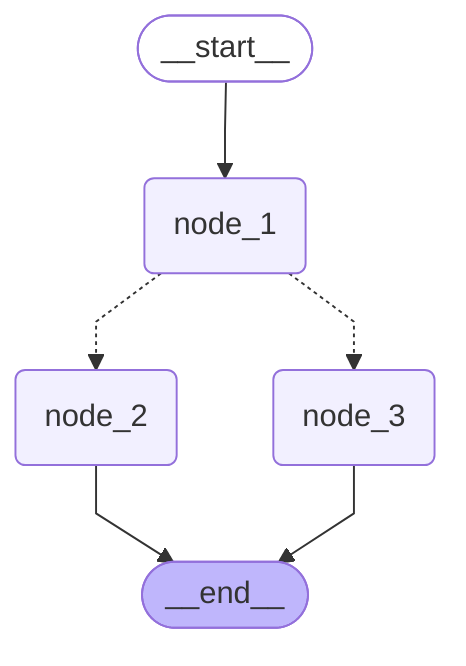

# LangGraph Visualization

Copy and paste this into [Mermaid Live Editor](https://mermaid.live/):

```mermaid
---
config:
  flowchart:
    curve: linear
---
graph TD;
	__start__([<p>__start__</p>]):::first
	node_1(node_1)
	node_2(node_2)
	node_3(node_3)
	__end__([<p>__end__</p>]):::last
	__start__ --> node_1;
	node_1 -.-> node_2;
	node_1 -.-> node_3;
	node_2 --> __end__;
	node_3 --> __end__;
	classDef default fill:#f2f0ff,line-height:1.2
	classDef first fill-opacity:0
	classDef last fill:#bfb6fc
```